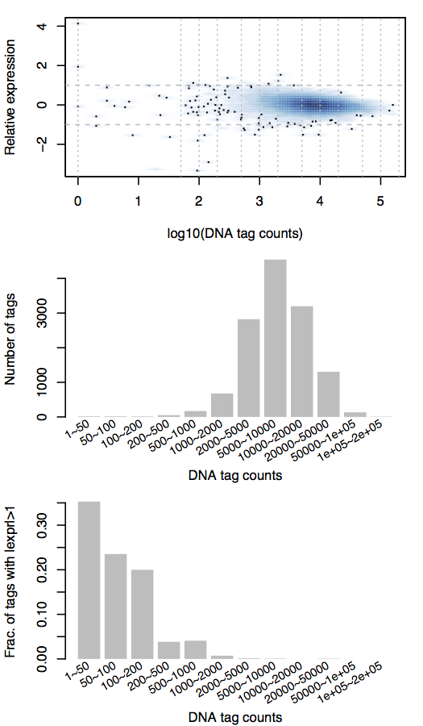

# Background

I have tried out MTSA (MPRA Tag Sequence Analysis) Tool. The runnable code can be found in [github page](https://github.com/Dongwon-Lee/mtsa). As of current, the repository does not contain a step-by-step explanation how to run the code but a straightforward bundle of script where you could modify on. To further ease potential tryouts, I have assembled this document for whoever might be interested in running it (I personally have runned it and found some issues with my dataset, hope you might have better luck).

## Utility of MTSA

Before the step-by-step, to illustrate the utility of this algorithm by two figures:


This figure just shows the expression score (simply, RNA/DNA) from two randomly picked barcode expression data for each CRE (cis-regulatory element). As one frequently observes, there can be quite a bit of variation on that score. I used to just combine all the barcodes for a CRE hoping that the multiple barcode effects will average out.


This figure shows the "corrected" expression score accounting for the effect of barcode sequences on the reporter transcript level. As is seen clearly, the variation of RNA/DNA ratio is significantly reduced, effectively increasing the discrimatory power of MPRA for downstream analysis.

## Brief description of the algorithm

My understanding of the algorithm is that by having the sequence information of the multiple barcodes representing a specific CRE, one can build a model that tries to explain the variation of RNA/DNA score within a CRE by a combination of the presence/absence of gapped k-mer sequences found in the barcode + the surrounding vector sequences.

In a perfect world of MPRA, barcode sequence would have no effect and we would get a very similar RNA/DNA score for every barcode sequence given an identical CRE. But that is not what we observe, and it tries to computationally "fix" this.

In terms of biologist perspective, it identifies potential sequences at the 3'UTR of a expression vector that could be bound by say miRNAs or other factors that modulate the transcription and/or stability of the mRNA.

The more number of barcode sequences you have for a particular CRE, it could infer more information of common sequence features that either consistently downregulate or upregulate a RNA/DNA value in a given set. Typically, more than 7 distinct barcode sequences might yield improvement.

## Pre-requisites

It only requires

* multiple barcodes representing one CRE
* those barcode sequences are known
* optionally the surrounding vector sequences for the barcode


It is recommended that 

* per barcode (not per CRE) the read count is around 100 ~ 1,000 reads, depending on the data sets.  Some datasets may require more reads to reliably estimate the barcode effects. 


# Step-by-step

## Run environment

The code runs in standard anaconda environment (Python 2 + standard gcc compiler). For installation, see [here](https://conda.io/docs/user-guide/install/download.html).


## Sample run

The github repository contains "public_data" directory which practically run example datasets and would be the go-to point to try out your own dataset.  `Melnikov2012` chosen because it is relatively small dataset that runs quick.

 * `0_get_raw_data.sh` grabs publicly available MPRA dataset (which has raw barcode sequences and individual reads provided)
 * `1_process_raw_data.sh` formats the data into the input format for the MTSA algorithm, 
 * `2_plot_plasmid_vs_norm_expr.sh` gives a simple plotting function to generate graphs to eyeball a few parameters to try
 * `3_mtsa_build_training_data.sh` builds the training data 
 * `4_mtsa_training.sh` actually runs the data according to the training dataset to correct the barcode effect for one particular dataset

For me, it was a good practice to run these scripts to get a feel how the program runs.

## You need just three inputs

For my own dataset, it might be more comfortable to use my own code up to the step 1 (`1_process_raw_data.sh`).

Only 3 formatted inputs are necessary:

* mpra_tags.txt: A file that contains the CRE names and barcode sequences  in tab-delimited format
* mpra_dna_counts.txt: A file that contains the CRE names and read counts of plasmid DNA for each barcodes in tab-delimited format
* mpra_mrna_counts.txt: A file that contains the CRE names and read counts of RNA (cDNA) for each barcodes in tab-delimited format


Just the first line of mpra_tags.txt looks like this:
```{r, eval=FALSE}
cl266@compute-a-16-82:~/mtsa/public_data/Inoue2017_processed$ head mpra_tags.txt -n 1
A:HNF4A-ChMod_chr10:11917871-11917984_[chr10:11917842-11918013]	CCTTATTCGCAACGT	CCTAGCATGAGCAAG	CGCTTCCTTATGCCT	TTAGAAGGTATCCAA	CCGCTTAGAACCAGT	CAGCTCAACTATTCC	TTAACGTTAATCTCG	ACGGCGGTCGCGTAC	GCAAGCCTCAAGTAC	TGCCTGATTGCTAAG	CCGCTTACGAACCTT	AGGTATTACGACTCT	TAACTCGCCTTACCG	CCTTACTGAACTTGG	TCTTGCATATAAGAT	CCGGACGATAAGCGC	CTAAGTTGGCTACGA	GTAGGAGCATCTATT	CCTCGCGATATATTC	GATAACCGCTGCTGA	GAGACCGTCTACTCC	TTCGCTCAATATAGC	AGCGCTTACGCTAGC	TTGCTTCAATTCAAC	TACCGGAACGTCTCA	ACCGGTTCGCGCTGG	TACCGAACGTACTCT	AGGTATCAGGTTACG	TAGTACGTCCGTCTT	GATTGCGTCCGATAA	GTTAAGGTTCCGTCC	GCTCCGGATGCAGCT	CAACTTCCGTCTTAT	TGGATGAAGTCGAGG	CGCTTCGAGGCCTCA	TTACTGAAGTAGTCG	TTAGACCTCAGGCCA	AGGCTGCAAGTCAGG	CCGCTCCAGTTACCG	CAGCTTCTTGAATGC	TGCAATAGTAGTAGG	ATGATATGATCATGA	TAAGCTTACGTCAGG	TCCGCTCGCCGTTAA	GCTCCGGACTTCGCC	GAACCTTCGCCATCG	CATCGTCCTACGTCT	CTAGCGTTCTCTAAG	CGTCCTTGCCTTGAG	ATATGCGCCTATGAT	TATGGACGGCTTACG	CAGCCTAATCTAGGT	ATGGAGTTAGACGGC	CTTGGATCCTCGGCA	CGCGAGTTAATTCTG	ATTCCGGCGTACTCT	TCGCCAGATTCCGGA	TGACCTATCTCGGTT	TTGCTCCATCGTTAG	CGATCTAACTCCGGA	CTTATGACGCCTGGT	CCAGTCGAGGTCTCA	GAGTTCAACTAGGCT	TAATCGTCTTCCGAC	TCCGCAAGTCTAGGT	AAGTCTGGATCAGCC	TCCTAGGAGCGAGAC	CTAATTACCGAGATT	GATAAGTTCTGAGAC	TCCTATTGAGTCTCA	GAGACGGCGTCGTAC	AATAGGCTACGTATA	CCTCGTACCGAGGCT	CATGACGTACGCCAT	GTATATGAAGTAAGC	CCAGTTAAGCATGAT	CTTATCAATTGGTAT	TCGGTCTTATGAGTT	CGTAATCATTGCTCC	CATGAACCTTCAGCT	TCGGTATATGAGTCG	GGCGTAACCTTACGA	GCTACTGGATAAGTC	TTCATTCTCAGAGAC	TCAGGTCGGTAACCT	TATCTTCGTTGATAA	AAGTCAATGCCAGAG	GGTCGTTATCGGCGT	TCCTAGACGCCGTAA	CTAGCATGATGACGC	ACTTCTGGATTCAAT	CGCAGCGCGAGAACG	AACCTCGGCAGAATC	GTAGTTCTATTCGGA	AGGTACGCAGTAAGC	TATCTCCGACTGATG	GGTCGCGATAAGCGC	CAGCTAGCGCAATAG	AGCATCATCGCTAAG	TTCTGGATAACTAGC
```


The first line of mpra_dna_counts.txt looks like this:
```{r, eval=FALSE}
A:HNF4A-ChMod_chr10:11917871-11917984_[chr10:11917842-11918013]	149	0	334	565	224	32	161	82	57	157	95	54	78	0	94	352	243	135	223	302	135	0	0	97	639	0	70	133	438	34	454	53	910	92	204	33	97	241	18	467	0	90	0	227	69	83	651	215	152	0	84	371	186	152	214	222	104	0	0	79	4	490	0	314	181	306	0	101	19	503	0	143	327	96	0	0	673	431	43	260	136	0	72	43	95	272	0	126	70	123	68	0	192	102	119	96	130	80	307	180
```

The first line of mpra_mrna_counts.txt looks like this:
```{r, eval=FALSE}
A:HNF4A-ChMod_chr10:11917871-11917984_[chr10:11917842-11918013]	1170	0	1667	2775	1357	292	1051	475	283	1013	653	467	377	0	469	2180	1211	1168	433	1737	847	0	0	655	5782	0	446	811	2307	180	3102	235	6741	461	1042	91	330	986	106	3065	0	383	0	1204	386	423	4066	1032	646	0	702	3343	936	462	963	950	720	0	0	840	14	3556	0	1981	1090	1598	0	728	187	2717	0	780	1274	497	0	0	4609	2824	204	1626	801	0	414	235	531	1602	0	611	443	618	418	0	888	698	598	389	633	251	1421	959
```


I have used the tidyverse code to generate the formatted matrices (which I can provide to you if you are interested), but I think for a bioinformatician this would be very straightforward to generate.

(Of course, for each files, the **order** of sequence and read counts should match.)

## Deciding the cut-off of DNA counts (and assessing the quality of the dataset)

In this step, the user practically decides which barcodes would be used for training the model. 

The idea is that the barcode should be well represented in the original MPRA plasmid library to reliably gauge the expression of a given CRE. If there are too few plasmids in the first place, random chances (non sequence-specific) could take over the most variation of expression than any sequence-specific effect.

This corresponds to `2_plot_plasmid_vs_norm_expr.sh`. It just practically generates a summary figure using Rscript, so could be done locally utilizing the code in  `scripts/plot_dna_vs_nexpr.R`.

```{r, eval=FALSE}
# Usage
Rscript ../scripts/plot_dna_vs_nexpr.R \
    mpra_dna_counts.txt \
    mpra_mrna_counts.txt \
    dna_vs_nexpr.pdf
```

It practically generates a dna_vs_nexpr.pdf file (or whatever file you supply):




The first figure shows the relative expression (within each CRE; log2(mRNA/DNA)) of each barcode expression data centered around the mean expression (=0). This gives a broad feeling of how much varition exists for each barcode sequences to the mean value. The more variation, the more issue of either sequence-specific or sequence non-specific (for example sequencing depth or representation issues of a particular barcode).

The second figure shows how well each barcodes are represented in the original library. In this example, most of the barcodes have around 5000~10000 read counts. This is to ensure that there are no loss of complexity of the original MPRA library (which you would have done anyway).

The last one, the important one is enumerating how many barcodes (here "tags") have more variation than 2-fold for a given CRE, given the representation in the original MPRA library. The sample shows that the more read counts in the MPRA library, you get less variation, suggesting that barcodes that have DNA read counts of a certain cut-off (here around 1000) might suffer from non-sequence specific variation.


So at the end of this step by eye balling, you decide:

* the minimum DNA read count threshold for a barcode to be eligible for training
    - As described above, with too small representation in the original plasmid library, sequence non-specific effect would sway over sequence specificity decreasing the efficacy of the training
* the minimum number of barcodes for a given CRE to be eligible for training
    - Since the training is done **per CRE basis** you need at least some number of trainable barcode expression information to effectively train your model


These two parameters will be supplied for the subsequent step. 

## Let's build the dataset for the model

This corresponds to the `3_mtsa_build_training_data.sh` script, and the code usage is this:

```{r, eval=FALSE}
# Usage example
INDIR=Melnikov2012_processed
../bin/mtsa.py build -m 1000 -t 5 -l CTAGA -r AGATC -n ${INDIR}/mtsa_mel12.m1000.t5.e5\
    ${INDIR}/mpra_dna_counts.txt ${INDIR}/mpra_mrna_counts.txt ${INDIR}/mpra_tags.txt
```

So each parameters will be explained:

* -m : this is the minimum number of read counts of the DNA (see above subsection)
* -t : this is the minimum number of barcodes for each CRE (see above subsection)
* -l (optional) : this is the sequence immediately 5' of the barcode sequence, because there are effects of flanking sequences in the expression vector; this increases the training time and for the first part could be dropped. Around 5bp would be enough.
* -r (optional) : same, the sequence immediately 3' of the barcode sequence in a given MPRA expression vector
* -n : prefix of the output files, which will be used for the actual training
* the last three file names are self-explanatory and corresponds to the three formatted files explained above


Running this will simply generate the output file given by -n, which essentially just separates the barcodes that will be used from the barcodes that will be not used for training (but will be corrected after the model has been trained):

```{r, eval=FALSE}
-rw-rw-r-- 1 cl266 cl266   6258 Nov  9 21:11 mtsa_mel12.m1000.t5.e5.excluded_tags.txt
-rw-rw-r-- 1 cl266 cl266 466609 Nov  9 21:11 mtsa_mel12.m1000.t5.e5.tag_rexpr.txt
```


## Let's make the model and see the corrected expression values!

This corresponds to the `4_mtsa_training.sh` script in the public_data directory.

```{r, eval=FALSE}
DATADIR=Melnikov2012_processed
../bin/mtsa.py train -n ${DATADIR}/mtsa_mel12.m1000.t5.e5
```

You just supply the same prefix created from the previous step.

It will generate a series of output files, but the last line of the run log will give you r^2 scores, how much the model would increase the fit from the original data.
